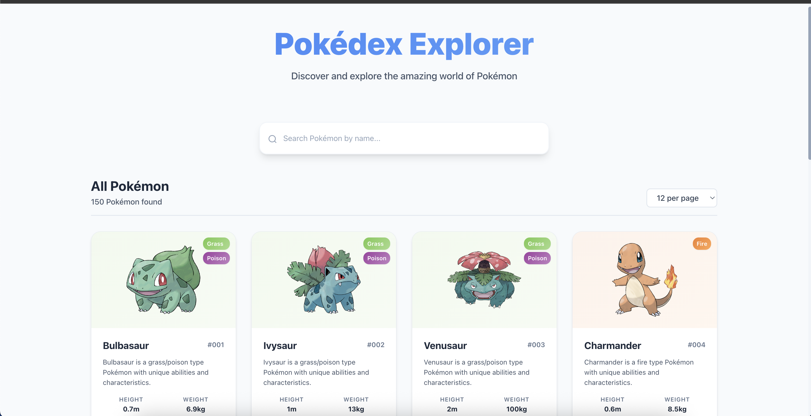
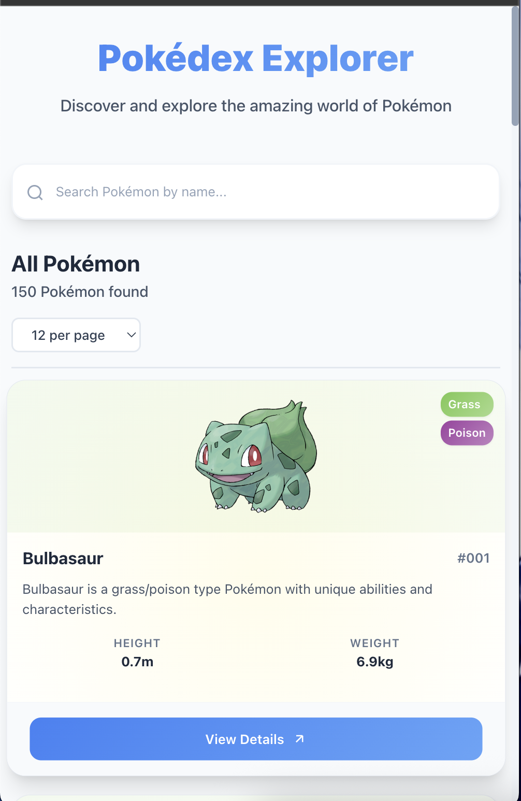
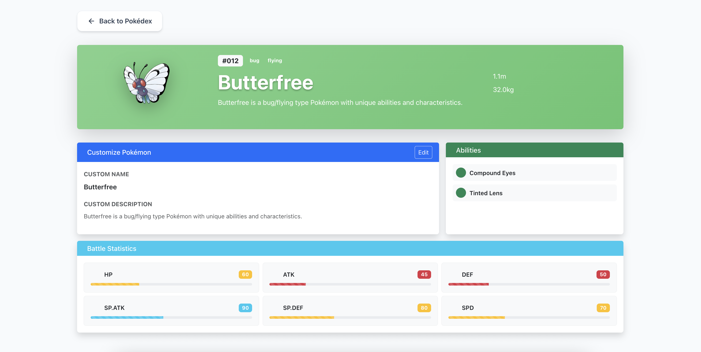
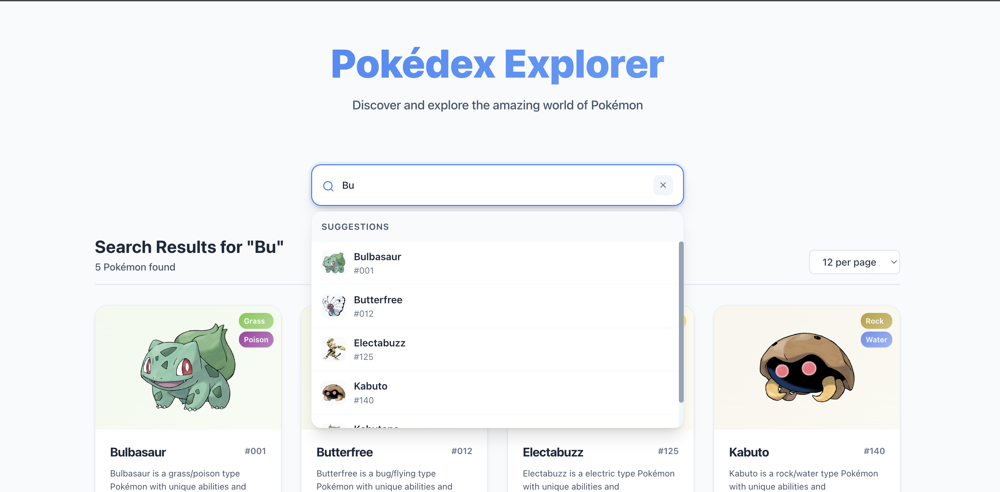
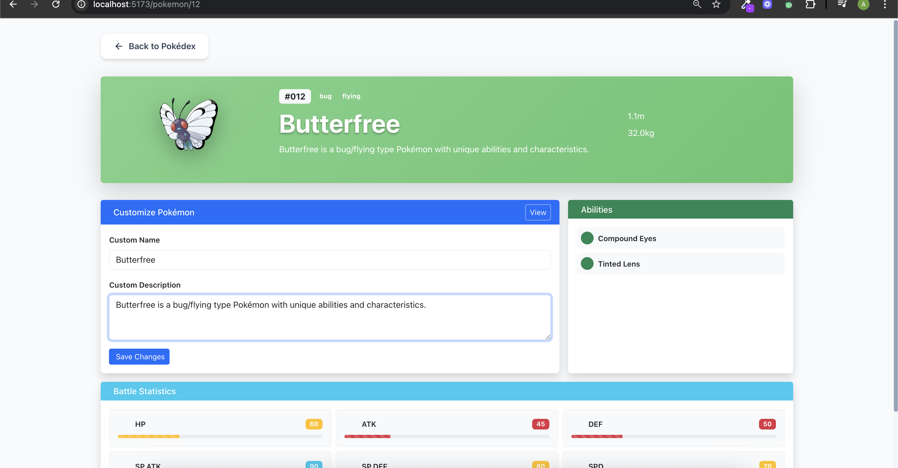
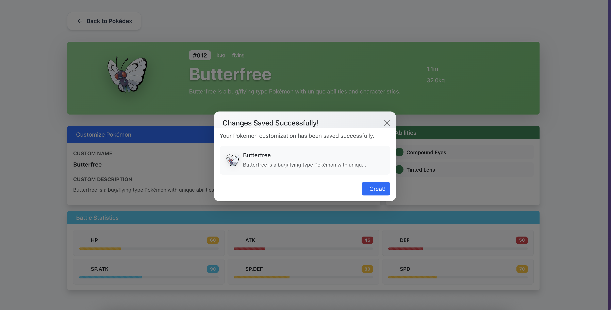
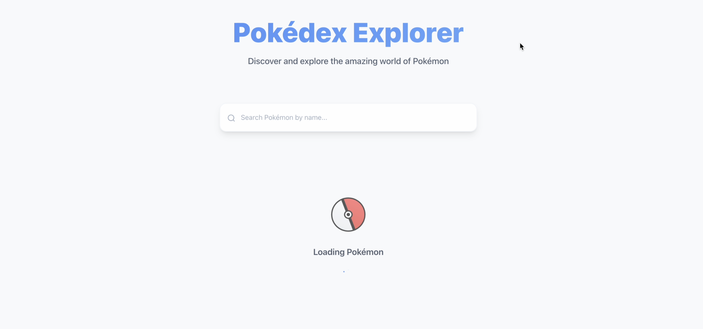
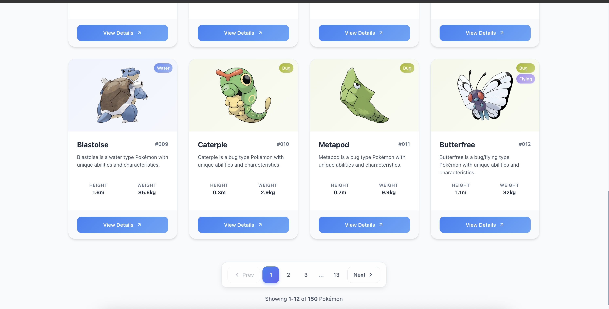
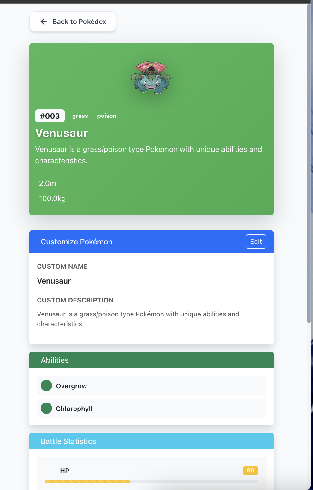

# Pokémon Explorer App



## Overview

Pokémon Explorer is a responsive Vue 3 application that showcases Pokémon data from the PokeAPI. Featuring a clean card-based interface, real-time search with auto-suggestions, detailed views, and editing capabilities, this app delivers an engaging user experience across all devices.

**Live Demo**: [https://muhammad-ali-mazhar-butt.github.io/Pokemon-Explorer-App/](https://muhammad-ali-mazhar-butt.github.io/Pokemon-Explorer-App/)  
**Source Code**: [https://github.com/MUHAMMAD-ALI-MAZHAR-BUTT/Pokemon-Explorer-App.git](https://github.com/MUHAMMAD-ALI-MAZHAR-BUTT/Pokemon-Explorer-App.git)

## Features

- **Beautiful Pokémon Display**: Responsive card grid layout
- **Advanced Search**: Real-time filtering with type-ahead suggestions
- **Detailed Views**: Comprehensive Pokémon statistics and information
- **Edit Functionality**: Customize Pokémon names and descriptions
- **Confirmation Modals**: Safe editing with user confirmation
- **Smart Pagination**: Navigate large collections easily
- **Loading Indicators**: Visual feedback during API requests
- **Responsive Design**: Optimized for mobile, tablet, and desktop
- **Environment Configuration**: Flexible API configuration

## Screenshots

| Feature                    | Preview                                                                   |
| -------------------------- | ------------------------------------------------------------------------- |
| **Home Page**              |                              |
| **Mobile View**            |            |
| **Pokémon Details**        |         |
| **Smart Auto Suggestions** |         |
| **Edit Form**              |                     |
| **Confirmation**           |              |
| **Loading State**          |               |
| **Pagination**             |                       |
| **Mobile Details**         |  |

## Technology Stack

- **Framework**: Vue 3 (Composition API)
- **Language**: TypeScript
- **State Management**: Pinia
- **UI Library**: Bootstrap 5.3
- **Routing**: Vue Router
- **HTTP Client**: Axios
- **Build Tool**: Vite

## Project Structure

```
pokemon-explorer/
├── .env.example
├── public/
│   └── images/
│       └── favIcon.jpg
├── src/
│   ├── assets/
│   ├── components/
│   │   ├── ConfirmationModal.vue
│   │   ├── LoaderSpinner.vue
│   │   ├── PaginationComponent.vue
│   │   ├── PokemonCard.vue
│   │   ├── PokemonDetailCard.vue
│   │   ├── PokemonGrid.vue
│   │   └── SearchBar.vue
│   ├── router/
│   │   └── index.ts
│   ├── store/
│   │   └── pokemon.ts
│   ├── types/
│   │   └── pokemon.d.ts
│   ├── views/
│   │   ├── DetailView.vue
│   │   └── HomeView.vue
│   ├── App.vue
│   └── main.ts
├── PokemonDemoScreenshots/
├── package.json
└── README.md
```

## Environment Configuration

Create a `.env` file in the project root with the following variables:

```env
# Base URL for PokeAPI
VITE_API_BASE_URL=https://pokeapi.co/api/v2
```

Use the `.env.example` file as a template:

```bash
cp .env.example .env
```

## Getting Started

### Prerequisites

- Node.js v18+
- npm v9+

### Installation

1. Clone the repository:

```bash
git clone https://github.com/MUHAMMAD-ALI-MAZHAR-BUTT/Pokemon-Explorer-App.git
cd pokemon-explorer
```

2. Install dependencies:

```bash
npm install
```

3. Configure environment (use `.env.example` as template):

```bash
cp .env.example .env
```

4. Start development server:

```bash
npm run dev
```

5. Access the application at:

```
http://localhost:5173
```

### Build for Production

```bash
npm run build
```

## Key Features

### Advanced Search Functionality

- Real-time filtering as you type
- Case-insensitive matching
- Type-ahead suggestions
- Instant results updating

### Detailed Pokémon Views

- Comprehensive stats display
- Type badges with color coding
- Ability listings
- Physical characteristics
- Responsive layout for all devices

### Editing Capabilities

- Custom name editing
- Description customization
- Confirmation modals before saving
- Persistent state management

### Performance Optimizations

- Loading spinners during API requests
- Efficient state management with Pinia
- Smart pagination for large datasets
- Responsive image loading

## Contact

**Muhammad Ali Mazhar Butt**  
Email: [ali123mazhar@gmail.com](mailto:ali123mazhar@gmail.com)
